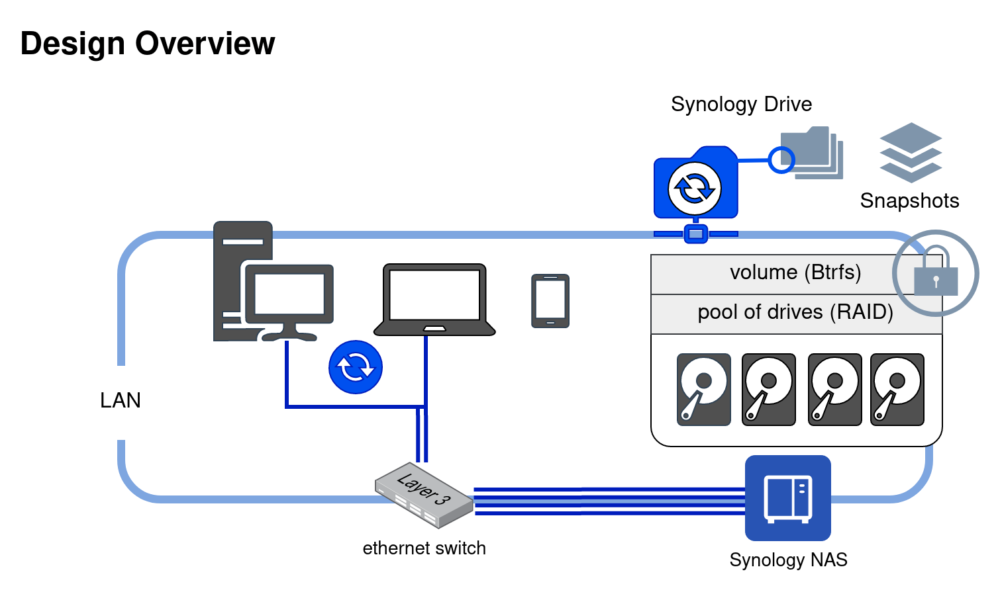
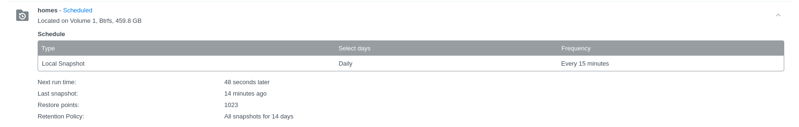

# Synology




## Hard drives

On models with 6+ hard drive bays, populate all bays -2 to leave room to grow the capacity for future needs.

Setup all available hard drives as one pool.

## Backups

Consider backup as **mandatory** and RAID as **high-availability (HA)**.

Schedule off-site backup to https://eu.c2.synology.com/ (or other).

frequency

-  every 8 hours (3x daily) = small business
-  every 4 hours (6x daily) = medium business

Integrity check once a weekly.

Target non-peak workload hours for backup/integrity checks.

**sample schedule**


## Snapshot Replication

https://kb.synology.com/en-us/DSM/tutorial/Quick_Start_Snapshot_Replication

**Prerequisites**

- install package "snapshot replication"
- Requires Btrfs volume (shared folder) or LUN.

A snapshot is a point-in-time copy of each file/directory on a volume from which you can recover from in case you need it.

Only file changes (deltas) on the volume are saved since the snapshot was created.

**Note:** Snapshots of encrypted shared folders cannot be browsed. Rollback to a new volume when necessary.

**Sample schedule**



-  frequency: every 15 minutes
-  keep all snapshots for: 14 days
-  make snapshot visible (ticked)

## SynologyDrive on Linux

**Synology prerequisites**

- install package "synology drive"
- enable "User Home" service: Control Panel > "USer & Group" > Advanced > Enable user home service

**Linux workstation**

Enable flathub repository.

```
sudo flatpak remote-add --if-not-exists flathub https://flathub.org/repo/flathub.flatpakrepo
```

Install Synology drive.

```
flatpak install com.synology.SynologyDrive
```

Autostart synology drive on login (Gnome)

```
mkdir ~/.config/autostart
cp /var/lib/flatpak/exports/share/applications/com.synology.SynologyDrive.desktop ~/.config/autostart/
```

**Optional:** configure appindicator to receive notifications.

```
sudo dnf install gnome-shell-extension-appindicator -y
```

- [enable the appindicator extension](https://extensions.gnome.org/extension/615/appindicator-support/)

Complete the setup by launching the synology drive application.

**Optional:** link files and folders to synology drive.

```
mv ~/.bashrc ~/drive/bashrc
ln -s ~/drive/bashrc ~/.bashrc

mv ~/.bash_history ~/drive/bash_history
ln -s ~/drive/bash_history ~/.bash_history

mv ~/.ssh ~/drive/ssh
ln -s ~/drive/ssh ~/.ssh

rmdir ~/Documents
ln -s ~/drive/documents/ ~/Documents
```
